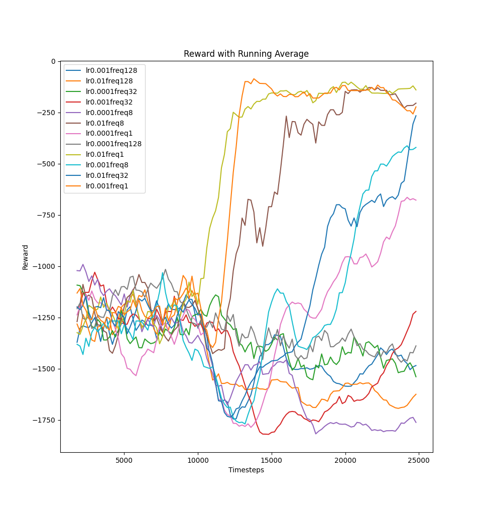

# Hyperparameter tuning

For the hyperparameter tuning i used the train.py internal optuna tuner.
With it i had a bit troubles fixing the gamma, the arguments where always overwritten, so i hardcoded gamma inside of the python file.
I let all other parameters get optimized.
Below are the tables with each 50 different hyperparameter configurations.
Somehow often a low update frequency lead to the best results, but when using the normal training script using these high update frequencies it didnt learn at all.
Therefore i decided to use the update frequency as a changing hyperparameter for task 2.

DDPG:

| #  | value     | batch | buffer  | lr                | net   | noise_std | tau  | freq |
|----|-----------|-------|---------|-------------------|-------|-----------|------|------|
| 0  | -149.07   | 100   | 10000   | 0.00938           | medium| 0.84308   | 0.02 | 8    |
| 1  | -991.75   | 100   | 1000000 | 0.04090           | small | 0.62751   | 0.001| 16   |
| 2  | -1048.55  | 128   | 1000000 | 1.59187e-05       | medium| 0.93268   | 0.005| 1    |
| 3  | -147.42   | 32    | 1000000 | 0.00113           | medium| 0.54894   | 0.005| 1    |
| 4  | -1388.46  | 32    | 10000   | 0.01382           | medium| 0.72439   | 0.08 | 16   |
| 5  | -152.09   | 100   | 100000  | 0.01243           | medium| 0.89335   | 0.005| 4    |
| 6  | -152.34   | 128   | 1000000 | 5.35279e-05       | big   | 0.98053   | 0.01 | 32   |
| 7  | -145.94   | 2048  | 100000  | 0.00131           | medium| 0.11837   | 0.01 | 16   |
| 8  | -145.55   | 64    | 1000000 | 0.00020           | medium| 0.85120   | 0.005| 4    |
| 9  | -155.57   | 2048  | 10000   | 0.00013           | big   | 0.08706   | 0.001| 8    |
| 10 | -153.47   | 64    | 1000000 | 0.00060           | medium| 0.86259   | 0.001| 16   |
| 11 | -148.31   | 256   | 100000  | 0.00625           | medium| 0.15197   | 0.01 | 64   |
| 12 | -1388.46  | 2048  | 100000  | 0.01669           | medium| 0.02364   | 0.08 | 16   |
| 13 | -178.62   | 64    | 1000000 | 0.01916           | small | 0.96590   | 0.005| 4    |
| 14 | -144.97   | 2048  | 1000000 | 6.64202e-05       | medium| 0.25988   | 0.01 | 16   |
| 15 | -149.52   | 256   | 1000000 | 4.80522e-05       | medium| 0.10672   | 0.01 | 32   |
| 16 | -1103.60  | 2048  | 1000000 | 1.06601e-05       | big   | 0.56606   | 0.01 | 1    |
| 17 | -145.98   | 2048  | 1000000 | 3.54569e-05       | medium| 0.54488   | 0.005| 16   |
| 18 | -1044.39  | 64    | 1000000 | 1.96854e-05       | medium| 0.93222   | 0.02 | 4    |
| 19 | -161.33   | 2048  | 1000000 | 0.00063           | small | 0.05293   | 0.001| 16   |
| 20 | -147.23   | 64    | 1000000 | 0.00017           | big   | 0.56401   | 0.05 | 64   |
| 21 | -885.30   | 2048  | 1000000 | 1.50524e-05       | medium| 0.16146   | 0.01 | 512  |
| 22 | -145.56   | 16    | 100000  | 0.00030           | medium| 0.11932   | 0.01 | 16   |
| 23 | -149.01   | 16    | 100000  | 0.00250           | medium| 0.28022   | 0.01 | 128  |
| 24 | -148.17   | 512   | 100000  | 4.62270e-05       | big   | 0.10201   | 0.01 | 512  |
| 25 | -1663.22  | 64    | 100000  | 2.26828e-05       | small | 0.98099   | 0.005| 4    |
| 26 | -708.34   | 2048  | 100000  | 2.33080e-05       | medium| 0.10679   | 0.02 | 8    |
| 27 | -147.00   | 32    | 10000   | 0.00030           | medium| 0.20164   | 0.01 | 16   |
| 28 | -145.91   | 64    | 1000000 | 0.00035           | medium| 0.16233   | 0.02 | 16   |
| 29 | -283.88   | 16    | 100000  | 0.00236           | medium| 0.07124   | 0.001| 16   |
| 30 | -149.98   | 128   | 100000  | 5.11322e-05       | medium| 0.14509   | 0.01 | 16   |
| 31 | -149.45   | 100   | 1000000 | 0.00153           | medium| 0.13841   | 0.02 | 16   |
| 32 | -144.32   | 64    | 1000000 | 0.00023           | medium| 0.21531   | 0.02 | 256  |
| 33 | -148.67   | 128   | 1000000 | 6.08258e-05       | medium| 0.04498   | 0.02 | 256  |
| 34 | -148.10   | 16    | 1000000 | 0.00122           | medium| 0.83860   | 0.005| 4    |
| 35 | -145.21   | 64    | 1000000 | 0.00042           | medium| 0.39074   | 0.005| 256  |
| 36 | -145.25   | 64    | 1000000 | 0.00020           | big   | 0.38317   | 0.02 | 128  |
| 37 | -832.40   | 64    | 10000   | 4.81671e-05       | medium| 0.42022   | 0.005| 256  |
| 38 | -145.75   | 64    | 1000000 | 0.00086           | big   | 0.48914   | 0.02 | 128  |
| 39 | -146.81   | 1024  | 1000000 | 0.00029           | medium| 0.42362   | 0.005| 32   |
| 40 | -904.72   | 64    | 1000000 | 2.81551e-05       | medium| 0.27343   | 0.08 | 256  |
| 41 | -154.61   | 64    | 1000000 | 0.00253           | small | 0.08582   | 0.005| 256  |
| 42 | -764.91   | 32    | 10000   | 4.52014e-05       | medium| 0.81281   | 0.005| 128  |
| 43 | -397.65   | 100   | 100000  | 5.61820e-05       | big   | 0.40044   | 0.02 | 256  |
| 44 | -147.79   | 2048  | 1000000 | 4.20083e-05       | medium| 0.12080   | 0.01 | 16   |
| 45 | -145.18   | 64    | 10000   | 0.00030           | big   | 0.93422   | 0.005| 4    |
| 46 | -150.01   | 64    | 10000   | 0.00352           | big   | 0.98097   | 0.005| 4    |
| 47 | -145.25   | 64    | 1000000 | 0.00077           | medium| 0.42888   | 0.02 | 256  |
| 48 | -149.58   | 2048  | 1000000 | 0.00151           | medium| 0.60592   | 0.02 | 256  |
| 49 | -146.28   | 32    | 10000   | 0.00017           | big   | 0.74653   | 0.01 | 4    |

TD3:

| #  | value       | batch | buffer  | lr                 | arch  | noise_std | tau  | freq |
|----|-------------|-------|---------|--------------------|-------|-----------|------|------|
| 0  | -170.1200988| 64    | 100000  | 0.0018775318726263963| med   | 0.6559348983522968| 0.02 | 4    |
| 1  | -170.8590788| 32    | 1000000 | 0.0026249903524404113| med   | 0.8833577828404736| 0.02 | 128  |
| 2  | -170.360041 | 64    | 10000   | 0.002672179618714738 | big   | 0.3664305545668013| 0.08 | 128  |
| 3  | -185.3450382| 128   | 10000   | 0.0015142425858563234| med   | 0.23734062537868583| 0.08 | 1    |
| 4  | -192.4073262| 128   | 10000   | 0.00014390196417306261| med   | 0.054978245108653456| 0.08 | 128  |
| 5  | -171.9675106| 2048  | 10000   | 0.0014079411350161363| med   | 0.5204794195051874| 0.08 | 64   |
| 6  | -192.0553894| 128   | 10000   | 0.00027774426121725374| med   | 0.6503170217209453| 0.05 | 16   |
| 7  | -169.4087716| 256   | 100000  | 0.0024691133479127587| med   | 0.5804414787218183| 0.05 | 64   |
| 8  | -169.6634082| 512   | 10000   | 0.0006784032193071002| small | 0.8688356967025642| 0.005| 128  |
| 9  | -1366.388729| 128   | 10000   | 0.22131915973162364  | med   | 0.25435683432833955| 0.001| 8    |
| 10 | -1154.0093768| 1024 | 100000  | 1.3062386587521335e-05| med   | 0.9173636461721053| 0.05 | 64   |
| 11 | -176.22103959999998| 512 | 10000 | 0.00024357384009888086| small | 0.7599733921627285| 0.005| 64   |
| 12 | -168.52738959999996| 64 | 100000 | 0.0006531589679198859| med   | 0.12799166680279606| 0.05 | 64   |
| 13 | -378.2991206| 64    | 100000  | 7.914790493416504e-05| med   | 0.21978840605142275| 0.05 | 64   |
| 14 | -1366.388729| 256   | 100000  | 0.03798258084695309  | med   | 0.376864575042945 | 0.08 | 8    |
| 15 | -168.1971248| 64    | 1000000 | 0.003914484372581664 | med   | 0.20915598759974188| 0.05 | 512  |
| 16 | -168.12323080000002| 128 | 1000000 | 0.004699570853226147 | med   | 0.19630032675515818| 0.05 | 256  |
| 17 | -170.1815434| 128   | 1000000 | 0.0015777169210989116| big   | 0.43986762313750466| 0.05 | 256  |
| 18 | -1366.388729| 32    | 1000000 | 0.019616401311253782 | med   | 0.06823071150712115| 0.05 | 512  |
| 19 | -1498.5037548| 16    | 1000000 | 0.007883233764940947 | med   | 0.3348453592145615| 0.01 | 256  |
| 20 | -170.9245954| 64    | 1000000 | 0.0032745907471952657| med   | 0.636993894837569 | 0.08 | 512  |
| 21 | -173.7082058| 16    | 100000  | 0.0002760749238156303| med   | 0.03614475260537013| 0.05 | 32   |
| 22 | -169.2524848| 64    | 1000000 | 0.00024322482795084628| med   | 0.030529982961703866| 0.02 | 64   |
| 23 | -168.14969100000002| 64 | 10000 | 0.002066217411568374 | med   | 0.0016839009041847153| 0.05 | 256  |
| 24 | -1366.388729| 64    | 10000   | 0.013387815679046051 | big   | 0.21302304202544756| 0.05 | 256  |
| 25 | -170.65758399999999| 32 | 10000 | 0.00024116346940292196| med   | 0.10775789543077943| 0.05 | 256  |
| 26 | -1498.5037548| 64   | 10000   | 0.013305851373270321 | med   | 0.06441057677435265| 0.05 | 4    |
| 27 | -170.84499539999996| 1024 | 1000000 | 0.011211411761229733 | small | 0.07386142474271717| 0.05 | 256  |
| 28 | -1498.5037548| 128  | 100000  | 0.028433213939968255 | med   | 0.2464655610216075| 0.005| 256  |
| 29 | -171.03045759999998| 1024 | 1000000 | 0.0006637341533445977| med   | 0.3985640100135328| 0.05 | 512  |
| 30 | -167.12878960000003| 64 | 1000000 | 0.0011129017239161613| small | 0.05653466866216936| 0.08 | 256  |
| 31 | -170.2663128| 64    | 1000000 | 0.001142237687087271 | big   | 0.04352839148785549| 0.08 | 512  |
| 32 | -442.07282319999996| 64 | 1000000 | 0.0001354301251155205| small | 0.029792756495946277| 0.08 | 256  |
| 33 | -188.1917942| 128   | 1000000 | 0.0005770764210615699| med   | 0.1732858874971929| 0.005| 1    |
| 34 | -170.07697159999998| 128 | 1000000 | 0.0033902548918220018| med   | 0.0362958289377982| 0.05 | 16   |
| 35 | -1366.388729| 128   | 1000000 | 0.0428379983135386   | med   | 0.15789263170170098| 0.05 | 256  |
| 36 | -171.21928160000002| 100 | 1000000 | 0.0004482664171799006| med   | 0.3834177102180907| 0.05 | 8    |
| 37 | -173.0032184| 64    | 10000   | 0.0012875711087462355| med   | 0.05762190884953178| 0.005| 256  |
| 38 | -1498.5037548| 64   | 1000000 | 0.06548530974554169  | small | 0.16628621800614657| 0.08 | 32   |
| 39 | -170.1573784| 512   | 1000000 | 0.0008382087526785956| med   | 0.18130085527050005| 0.08 | 256  |
| 40 | -1366.388729| 64    | 1000000 | 0.010813464551790171 | med   | 0.1986896534532694| 0.005| 512  |
| 41 | -173.9745234| 64    | 1000000 | 0.008826636544939764 | med   | 0.27032037271270826| 0.05 | 256  |
| 42 | -169.2946238| 64    | 100000  | 0.0016141598868090383| med   | 0.1894430425267197| 0.05 | 512  |
| 43 | -168.2997882| 1024  | 100000  | 0.002653550748513721 | med   | 0.1487153710661818| 0.08 | 64   |
| 44 | -170.2214888| 1024  | 100000  | 0.0007383822667115721| small | 0.10741717167132944| 0.08 | 64   |
| 45 | -170.1933072| 256   | 1000000 | 0.0039527794596533414| small | 0.14447730876591547| 0.08 | 256  |
| 46 | -171.3542252| 2048  | 100000  | 0.0005186543562452739| med   | 0.02409954908319681| 0.08 | 64   |
| 47 | -167.3597612| 1024  | 100000  | 0.0026831791058365352| med   | 0.02885592369644055| 0.01 | 128  |
| 48 | -169.6315608| 512   | 100000  | 0.0008558352777677631| med   | 0.10856133643450451| 0.01 | 128  |
| 49 | -1498.5037548| 1024  | 100000  | 0.08259858245253404  | med   | 0.03662831506788966| 0.01 | 128  |

zac:

| #  | value       | batch | buffer  | lr                 | arch  | tau  | freq |
|----|-------------|-------|---------|--------------------|-------|------|------|
| 0  |             | 128   | 1000000 | 0.741770314574336  | med   | 0.08 | 4    |
| 1  | -1170.9680084| 16   | 10000   | 3.0979580160525174e-05| med   | 0.005| 4    |
| 2  | -199.82772519999997| 2048 | 100000 | 0.01514067896266551 | big   | 0.05 | 512  |
| 3  |             | 128   | 10000   | 0.3037748322834375 | small | 0.01 | 256  |
| 4  | -206.14288900000003| 1024 | 1000000 | 0.0007588595577385696| med   | 0.08 | 512  |
| 5  |             | 64    | 100000  | 0.16211876309466444 | big   | 0.05 | 64   |
| 6  | -205.85734779999999| 128   | 10000   | 0.00034207328183841055| big   | 0.005| 4    |
| 7  | -720.3216856| 1024  | 10000   | 2.022323410151494e-05| big   | 0.08 | 256  |
| 8  | -209.3814972| 64    | 1000000 | 0.0008669778527549367| med   | 0.01 | 1    |
| 9  | -210.09726719999998| 32    | 1000000 | 0.02156290451514205 | big   | 0.08 | 32   |
| 10 | -196.5264368| 256   | 100000  | 0.00245040478330128 | big   | 0.05 | 512  |
| 11 | -211.74791019999998| 16    | 100000  | 0.000530363229794137 | big   | 0.05 | 512  |
| 12 |             | 2048  | 100000  | 0.9170722079823478 | big   | 0.05 | 32   |
| 13 | -198.7213348| 256   | 100000  | 0.021099630823807343| med   | 0.05 | 512  |
| 14 | -205.8586244| 256   | 100000  | 0.040262411210383084| med   | 0.005| 512  |
| 15 | -209.28209  | 256   | 100000  | 0.0004803920636485792| med   | 0.05 | 256  |
| 16 | -949.1057506| 256   | 10000   | 1.8446669052736592e-05| big   | 0.05 | 512  |
| 17 | -1351.7214056| 256  | 100000  | 0.023006385768634514| med   | 0.01 | 128  |
| 18 |             | 256   | 100000  | 0.31801947369513206| med   | 0.05 | 128  |
| 19 | -203.5168974| 512   | 10000   | 0.002166394667276442| med   | 0.05 | 512  |
| 20 | -201.8468512| 256   | 10000   | 0.0033579207398636702| big   | 0.05 | 8    |
| 21 | -1471.7651535999998| 256 | 1000000 | 0.027273845025851513| big   | 0.01 | 512  |
| 22 | -200.4486168| 256   | 100000  | 0.004818883155383444| small | 0.05 | 512  |
| 23 | -213.5920274| 128   | 100000  | 0.037375834131464114| med   | 0.05 | 512  |
| 24 | -195.84527039999998| 2048 | 100000 | 0.0014629696659627502| big   | 0.005| 512  |
| 25 | -197.2806214| 2048  | 100000  | 0.0006242106977212753| big   | 0.005| 256  |
| 26 | -197.94267399999998| 2048 | 100000 | 0.0015745433411354479| big   | 0.005| 1    |
| 27 | -203.756475 | 128   | 10000   | 0.0011009096605457643| big   | 0.005| 256  |
| 28 | -203.39220720000003| 256 | 100000 | 0.00016400248184833053| big   | 0.005| 32   |
| 29 | -206.19483359999998| 128 | 100000 | 0.0002215994520193135| med   | 0.005| 512  |
| 30 | -1250.2948084000002| 2048 | 100000 | 5.195532323836432e-05| big   | 0.05 | 256  |
| 31 | -209.8291814| 2048  | 10000   | 0.0005267858408097092| big   | 0.005| 512  |
| 32 | -200.1009688| 16    | 100000  | 0.0021930599073765795| big   | 0.005| 128  |
| 33 | -197.4871368| 2048  | 100000  | 0.0005815018949165667| big   | 0.08 | 512  |
| 34 | -199.7138726| 2048  | 100000  | 0.0012819973055063069| small | 0.01 | 256  |
| 35 | -226.9418044| 64    | 100000  | 0.00014242417712458046| big   | 0.001| 512  |
| 36 | -210.248239 | 2048  | 100000  | 0.002093143094213713| small | 0.08 | 512  |
| 37 | -197.94846959999998| 2048 | 100000 | 0.00015829079855318447| big   | 0.08 | 8    |
| 38 | -203.0086918| 32    | 100000  | 0.005573646370852084| big   | 0.08 | 16   |
| 39 | -210.3160006| 64    | 100000  | 0.002492473488289927| small | 0.005| 512  |
| 40 | -205.0444724| 256   | 100000  | 0.000277650961777873| big   | 0.05 | 16   |
| 41 | -194.78790120000002| 2048 | 100000 | 0.0076741155152266665| big   | 0.005| 256  |
| 42 | -196.49839060000002| 2048 | 100000 | 0.00257696286804088 | big   | 0.08 | 16   |
| 43 | -197.320829 | 2048  | 100000  | 0.0009894288746497028| big   | 0.005| 64   |
| 44 | -203.4548868| 64    | 1000000 | 0.003139522115662888| big   | 0.08 | 16   |
| 45 | -199.02825360000003| 2048 | 100000 | 0.002159510587670641| big   | 0.02 | 16   |
| 46 | -195.7877546| 2048  | 100000  | 0.016119874897091855| big   | 0.08 | 256  |
| 47 | -211.91145820000003| 16 | 100000 | 0.00918091936511538 | big   | 0.08 | 256  |
| 48 | -202.56893359999998| 512 | 100000 | 0.018460175000489645| med   | 0.08 | 16   |
| 49 |             | 1024  | 100000  | 0.3758005869181941 | big   | 0.08 | 256  |

# Task 2

I experimented with changing both the update frequency and the learning rate.
For plotting this part i wrote a custom script, since i couldnt find my way with the plot_train.py script. Somehow i was not able to find detailed documentation and therefore failed to set the timestamp range.

I let the n_timestamps on all three experiments at 25000, even though td3 and sac with good parameters learned way faster. I did that to also catch the slower learning settings.
This shows, that in sac the good configurations learn super fast, but the worse configurations are about as slow as they are in td3.
While in td3 the difference between good and bad configurations is lower, but overall slower.

Since higher learning rates looked generally better i added another evaluation with higher learning rates.
Due to too many lines i split them to new graphs.

## LR from 0.01 to 0.0001

### DDPG

### TD3

### SAC

## LR from 1 to 0.1

### DDPG

### TD3

### SAC

